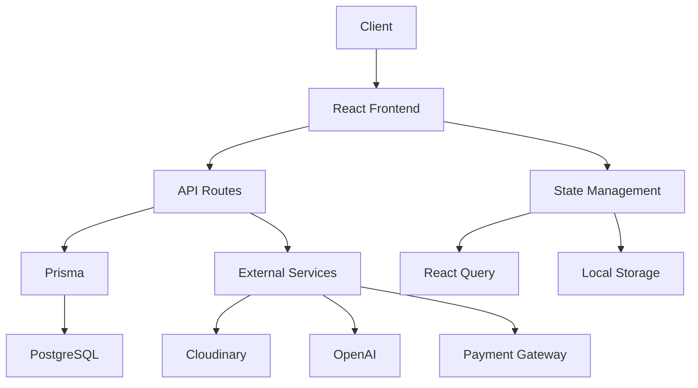

# XDose – MVP Flow

## MVP Flow
1. Authentification utilisateur (email/mot de passe)
2. Redirection vers Feed ou Discover selon le rôle
3. Navigation fluide entre les sections principales
4. Accès au Studio pour les créateurs uniquement
5. Création et publication de contenu
6. Interaction avec le contenu (like, commentaire, partage)
7. Gestion du profil et des paramètres

---

## Launch Features (MVP)

### Authentication & User Management
_Systeme d'authentification sécurisé avec gestion des rôles créateur/viewer_

* Authentification email/mot de passe
* Gestion des sessions (2h expiration)
* Vérification des rôles
* Redirection intelligente post-login

#### Tech Involved
* Application React avec TypeScript et Vite pour le frontend
* Prisma pour l'ORM
* PostgreSQL pour la base de données
* JWT pour la gestion des sessions

#### Main Requirements
* Sécurité renforcée
* UX fluide
* Gestion des erreurs
* Persistance de session

---

### Feed & Content Discovery
_Feed personnalisé vertical avec stories et découverte de contenu_

* Feed vertical scrollable
* Stories immersives
* Système de découverte IA
* Filtres et catégories

#### Tech Involved
* React Query pour la gestion d'état
* Tailwind CSS pour le styling
* Framer Motion pour les animations
* TensorFlow.js pour les recommandations

#### Main Requirements
* Performance optimale
* Chargement infini
* Cache intelligent
* Animations fluides

---

### Creator Studio
_Studio de création premium avec outils IA et templates_

* Éditeur de contenu
* Templates prédéfinis
* Intégration IA
* Gestion des médias

#### Tech Involved
* FFmpeg pour le traitement vidéo
* OpenAI API pour l'assistance IA
* Cloudinary pour le stockage
* WebSocket pour la collaboration

#### Main Requirements
* Interface premium
* Performance optimale
* Sauvegarde automatique
* Export multi-format

---

## System Diagram

---

## Questions & Clarifications
* Quelle stratégie de monétisation prioriser pour le MVP ?
* Comment gérer la scalabilité du stockage des médias ?
* Quels sont les KPIs principaux à suivre ?
* Comment gérer la modération du contenu ?
* Quelle stratégie de cache adopter pour le feed ?

<warnings-or-guidance>
* Considérer une architecture microservices pour la scalabilité
* Implémenter un système de cache distribué (Redis)
* Mettre en place un monitoring robuste (Sentry, Datadog)
* Prévoir une stratégie de backup et recovery
* Considérer l'utilisation de CDN pour les assets statiques
</warnings-or-guidance> 